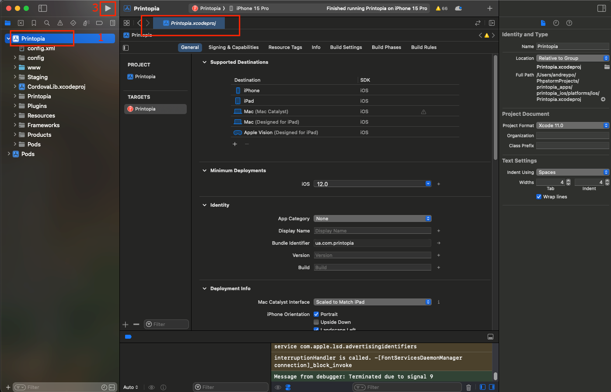

# Printopia Mobile Application

Printopia is a mobile application that allows users to print documents from their mobile devices to a printer. The application is built using Apache Cordova, a platform for building mobile applications using web technologies. The application is designed to run on Android devices.

## Prerequisites

Before you can build and run the Printopia mobile application, you need to have the following installed:

- Node: >=16.13.0
- Cordova CLI
- Cocoapods: >=1.8.0
- Xcode (xcodebuild): >=11.0.0
- ios-deploy: >=1.9.2

## Setting Up the Development Environment

1. **Install Node.js**: Download and install Node.js from [nodejs.org](https://nodejs.org/).
2. **Install Cordova CLI**: Use npm to install Cordova globally. **npm install -g cordova**
3. **Install xcode and cocoapods**: Use xcodebuild to install xcode and cocoapods to install cocoapods globally. **sudo gem install cocoapods**
4. **Several command-line tools need to be enabled for Cordova:  xcode-select --install**

## Building the Application

To build the Printopia application, follow these steps:

1. **Clone the Repository**
2. **npm install**
3. **cordova platform add ios**
4. **Build a bundle in the debug mode: cordova build ios**
5. **Check Requirements: cordova requirements**
6. **Release build: cordova build ios --release**
7. **cd platforms/ios && pod update - Чтобы обновить зависимости**
8. **Run app: cordova run ios**

## Signing app:
# Alias = Printopia, password: 12344321
1. Download private key with .pem extensions from the Google Play Console
2. Create keystore file: keytool -genkeypair -v -keystore printopia.keystore -keyalg RSA -keysize 2048 -validity 10000 -alias printopia
3. Sign .aab file: jarsigner -verbose -sigalg SHA256withRSA -digestalg SHA-256 -keystore ./printopia.keystore /Users/andreypo/PhpstormProjects/printopia_apps/printopia_android/platforms/android/app/build/outputs/bundle/release/app-release.aab Printopia

## Running the Application
1. **Run the Application on an Emulator**: Use Xcode to create an iOS Virtual Device (AVD) and run the application on it.
2. **Click on the Build button in Xcode**
3. **Run the application on the emulator**
   

## Quick commands
1. **build.sh** - build the application: add the platform, build the application
2. **reset.sh** - reset the application: remove the platform, add the platform, build the application

## Deploying the Application to the App Store
1. **Run build in Xcode**: This script will build the application in release mode and sign it with the keystore.
2. **Upload the .ipa file to the App Store**: Go to the App Store and upload the .ipa file.

